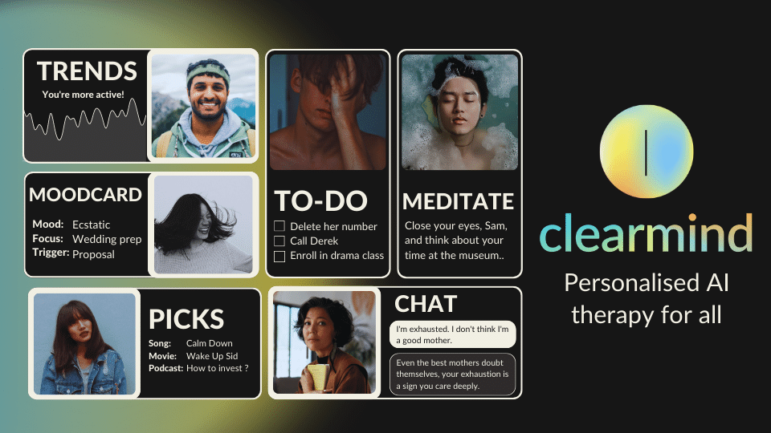

# Clear - Mental Health & Brainwave Analysis

<p align="center">
  
</p>

**Clear** is a Streamlit-based app that combines **behavioral psychology, speech analysis, facial emotion detection, and brainwave monitoring** to help users understand and improve their mental wellness.

---

## Key Features

### 1. Voice Analysis
- Users share their raw emotions via text or audio.
- Transcription and translation using **OpenAI Whisper**.
- NLP-powered **mood and cognitive analysis** with personalized recommendations.
- Suggestions include **songs, podcasts, meditations, and movies** tailored to your mood.

### 2. Facial Emotion Analysis
- Real-time video capture via webcam.
- Measures emotional expression and patterns.
- Displays insights with **interactive charts**.
- Users can **record and download** videos for review.

### 3. CSV Emotion Visualization
- Upload CSV files with emotion scores.
- Visualizations include:
  - **Doughnut chart**
  - **Area chart**
  - **Bar chart**
  - **Cluster graph**
  - **Treemap**
- Helps track top emotions in a visual format.

### 4. Brainwave Analysis (EEG)
- Upload WAV files to analyze brain activity.
- Generates **spectrograms, alpha wave analysis, and boxplots**.
- Computes statistics like mean, standard deviation, and **T-test results**.
- Smooths data and highlights differences between **eyes open vs. eyes closed** states.
- Facilitates understanding of **focus, calmness, and cognitive activity**.

---

## How It Works
1. User provides **input via text, audio, or video**.
2. The app uses **LangChain + OpenAI GPT-4** to analyze inputs.
3. Generates **insights and recommendations** for mental wellness.
4. Visualizes results with **interactive charts and plots**.
5. Stores conversation history for **context-aware follow-ups**.

---

## Technologies Used
- **Python, Streamlit** for the web app interface
- **OpenAI GPT-4 & Whisper** for NLP and transcription
- **LangChain** for memory, prompts, and conversational context
- **Matplotlib, Plotly, SciPy** for data visualization and brainwave analysis
- **OpenCV** for facial emotion detection

---

## How to Use
- Run the app with Streamlit:  
  ```bash
  streamlit run app.py
  
* pic credits: clearmind
